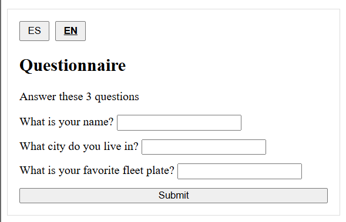
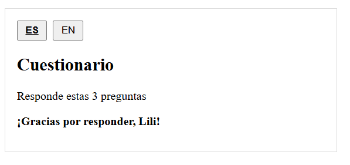
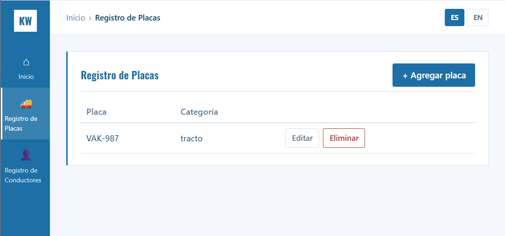
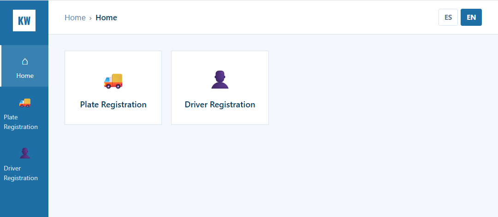
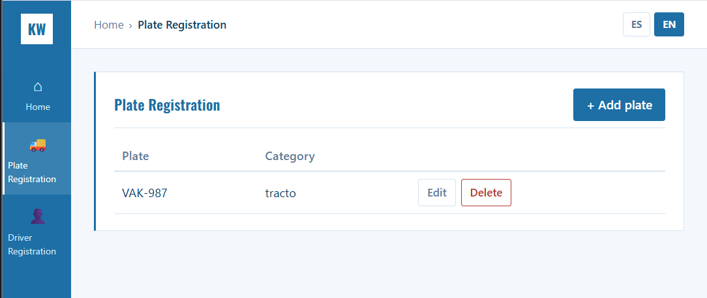

# Sistema de Registro de Placas y Conductores (Tarea 1 y 2)

Aplicación de arquitectura en capas (Frontend / Backend-Logic / RDBMS) con
sidebar de navegación y 2 módulos, cada uno con su formulario en modal
("+ Agregar") para no sobrecargar la pantalla:

1. **Inicio** — accesos directos a los módulos (tiles)
2. **Registro de Placas** — placa + categoría (tracto/carreta)
3. **Registro de Conductores** — nombre, DNI, número de licencia

Paleta de color: blanco + azul.

## Mapeo con la arquitectura n-capas

| Capa                  | En este proyecto                                              |
|-----------------------|------------------------------------------------------------------|
| Frontend / UI          | `frontend/` (Vue 3 + Vite + vue-router), sidebar + 3 vistas    |
| Backend / Logic        | `backend/` — controllers -> services -> repositories (SoC)     |
| RDBMS                   | PostgreSQL, vía Sequelize                                       |

Cada capa solo conoce a la inmediatamente inferior:
- `controllers/` solo llaman a `services/`
- `services/` solo llaman a `repositories/`
- `repositories/` son el único lugar que importa `models/` (Sequelize)

## Tarea 2 — Stateful vs Stateless

**Stateless** (`backend/services/validacionesService.js`), funciones puras
de validación de formato — mismo input, mismo output siempre:
1. `validarFormatoPlaca(placa)` — valida formato de placa (3 letras + 3 dígitos).
2. `validarDNI(dni)` — valida que el DNI tenga 8 dígitos.

**Stateful** (`backend/services/statefulService.js`), estado en memoria del
proceso Node (no en la base de datos):
1. `registrarIntentoCreacion(clave)` — limita a 5 registros por sesión y por
   módulo (`placas:sesionId`, `conductores:sesionId`); usado en
   `placaService.crear` y `conductorService.crear`.
2. `obtenerConCache(clave, fetchFn)` — cachea listados por 60s; se invalida
   al crear/editar/eliminar. Verificable con el header
   `X-Data-Source: cache|db` en las respuestas de `/api/placas` y `/api/conductores`.

## Como correrlo

1. Base de datos:
   ```
   createdb katwil
   ```
2. Backend:
   ```
   cd backend
   cp .env.example .env
   npm install
   npm run dev
   ```
3. Frontend (otra terminal):
   ```
   cd frontend
   npm install
   npm run dev
   ```
4. Abrir http://localhost:5173

## Nota sobre cambios de esquema

Si vuelves a modificar los campos de `Placa` o `Conductor`, `sequelize.sync()`
no altera tablas existentes — hay que recrear la base de datos:
```
dropdb katwil && createdb katwil
```

## Pendiente / fuera de alcance

- Módulos de Documentos y Novedades: se descartaron por ahora para mantener
  la app "sencilla" según lo pedido; el dominio queda abierto a agregarlos después.
- Autenticación de usuarios.

## Tarea 3 — Internacionalización (i18n)

Se agregó `vue-i18n` al frontend. El idioma depende de un parámetro de la
URL, tal como pide el enunciado:

- `http://localhost:5173/?lang=es` → interfaz en español (por defecto si no se pasa el parámetro)
- `http://localhost:5173/?lang=en` → interfaz en inglés

También hay un selector visible (ES / EN) en la barra superior para cambiar
de idioma sin editar la URL — al usarlo, el parámetro `?lang=` de la URL se
actualiza solo, para que el idioma elegido se mantenga si se recarga la página
o se comparte el link.

**Archivos relevantes:**
- `frontend/src/i18n/es.json`, `frontend/src/i18n/en.json` — diccionarios de traducción
- `frontend/src/i18n/index.js` — configuración de vue-i18n y detección del parámetro `lang`
- `frontend/src/App.vue` — selector de idioma (botones ES/EN)

**Alcance:** se tradujo toda la interfaz estática (menú, títulos, tablas,
formularios, botones). Los mensajes de error que vienen del backend (ej.
"DNI inválido") siguen en español, porque el backend no tiene i18n
implementado — solo el frontend, que es donde vive la interfaz visible.

## Capturas de pantalla













