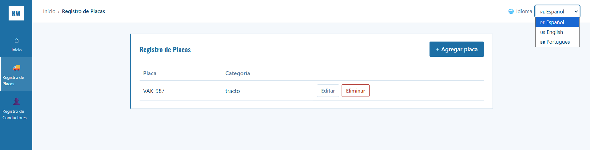
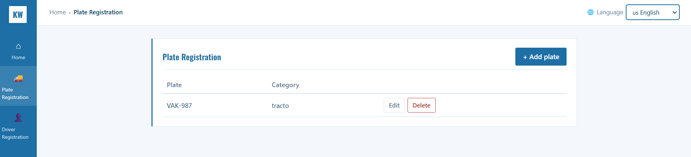
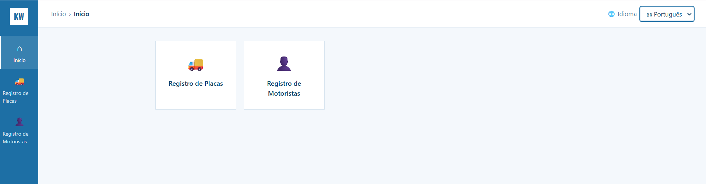
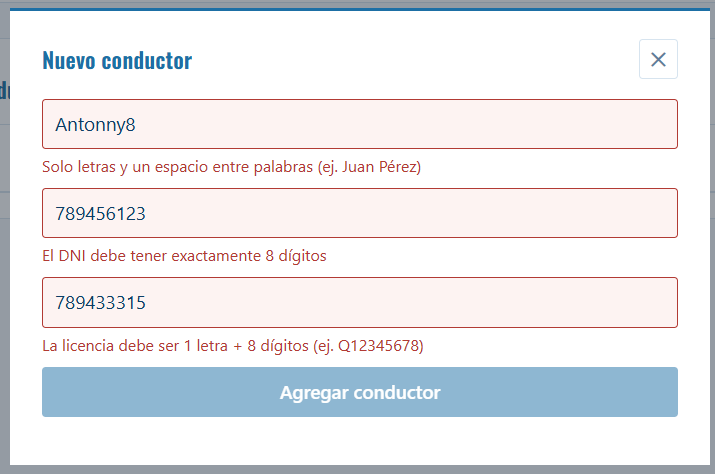

# Tarea 04 — Aplicación web con internacionalización y regex

Esta práctica continúa el proyecto (Registro de Placas y Conductores) de la tarea-03.
Se le agregaron dos cosas:

1. Un **menú desplegable** para elegir el idioma de la aplicación (Español, English, Português).
2. **Validación de formularios con Expresiones Regulares (regex)**, con mensajes de error en el idioma elegido.

---

## Tecnologías usadas

| Parte    | Herramientas                                   |
|----------|------------------------------------------------|
| Frontend | Vue 3, Vite, vue-router, **vue-i18n**          |
| Backend  | Node.js, Express, Sequelize                    |
| Base de datos | PostgreSQL                                |

---

## Desarrollo

### Paso 1 — Copia del proyecto anterior
Se copió la tarea-03 en la carpeta `tarea04/` para no modificar la entrega anterior.
También se quitaron los archivos que no se usaban (una vista de cuestionario y unas traducciones repetidas).

### Paso 2 — Archivos de traducción
Cada idioma tiene un archivo JSON con los mismos textos, pero traducidos:

```
frontend/src/i18n/
├── es.json   → Español
├── en.json   → English
├── pt.json   → Português (nuevo)
└── index.js  → configuración de vue-i18n
```

Ejemplo (el mismo texto en los tres archivos):

```json
"validacion": { "dni": "El DNI debe tener exactamente 8 dígitos" }      // es
"validacion": { "dni": "The ID number must have exactly 8 digits" }     // en
"validacion": { "dni": "O documento deve ter exatamente 8 dígitos" }    // pt
```

En las vistas ya no se escribe el texto directamente, sino la **clave**: `{{ t('validacion.dni') }}`.

### Paso 3 — Menú desplegable de idioma
En la barra superior (`frontend/src/App.vue`) los botones ES/EN se reemplazaron por un `<select>`:

```html
<select :value="locale" @change="cambiarIdioma($event.target.value)">
  <option v-for="idioma in IDIOMAS" :value="idioma.codigo">
    {{ idioma.bandera }} {{ idioma.nombre }}
  </option>
</select>
```

Al elegir un idioma:
- Toda la interfaz cambia al instante, sin recargar la página.
- Se guarda en `localStorage`, así la app recuerda el idioma la próxima vez.
- Se actualiza la URL con `?lang=es`, `?lang=en` o `?lang=pt` (se puede compartir el link con el idioma).

### Paso 4 — Validación con Expresiones Regulares
Las regex están en un solo archivo, `frontend/src/utils/validaciones.js`, y se usan en los formularios de **Conductores** y **Placas**:

| Campo     | Expresión regular                                   | Qué significa                               |  Válido     |  Inválido   |
|-----------|-----------------------------------------------------|---------------------------------------------|--------------|--------------|
| Nombre    | `^[A-Za-zÁÉÍÓÚÜáéíóúüÑñ]+( [A-Za-zÁÉÍÓÚÜáéíóúüÑñ]+)*$` | Solo letras, con un espacio entre palabras | `Juan Pérez` | `Juan123`    |
| DNI       | `^\d{8}$`                                           | Exactamente 8 dígitos                       | `12345678`   | `1234`       |
| Licencia  | `^[A-Z]\d{8}$`                                      | 1 letra seguida de 8 dígitos                | `Q12345678`  | `12345678`   |
| Placa     | `^[A-Z]{3}-?\d{3}$`                                 | 3 letras, guion opcional y 3 dígitos        | `ABC-123`    | `AB-12`      |


Funcionamiento en el formulario:
- La validación se hace **mientras el usuario escribe**.
- Si el dato no cumple la regex, el campo se pone **rojo** y aparece el mensaje de error debajo.
- Si el dato es correcto, el campo se pone **verde**.
- El botón **Guardar se desactiva** mientras haya errores.
- El mensaje de error sale **en el idioma seleccionado** (aquí se juntan la i18n y las regex).

---

## Cómo ejecutarlo

1. Crear la base de datos:
   ```
   createdb katwil
   ```
2. Backend:
   ```
   cd backend
   cp .env.example .env
   npm install
   npm run dev
   ```
3. Frontend (en otra terminal):
   ```
   cd frontend
   npm install
   npm run dev
   ```
4. Abrir http://localhost:5173 (o http://localhost:5173/?lang=en para entrar en inglés).

---

## Capturas de pantalla

> Guardar las imágenes en la carpeta `docs/img/` con los nombres indicados.

### 1. Menú desplegable de idiomas



### 3. Aplicación en Inglés


### 4. Aplicación en Portugués


### 5. Formulario con errores de validación (regex)



### 7. Formulario con datos válidos


---
