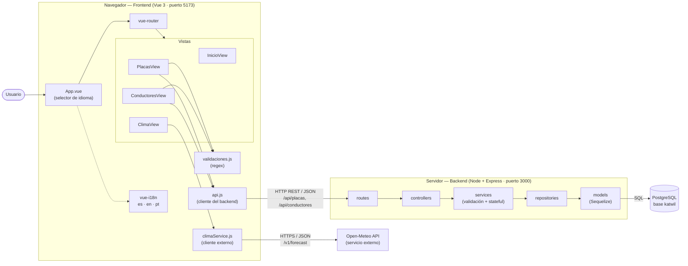
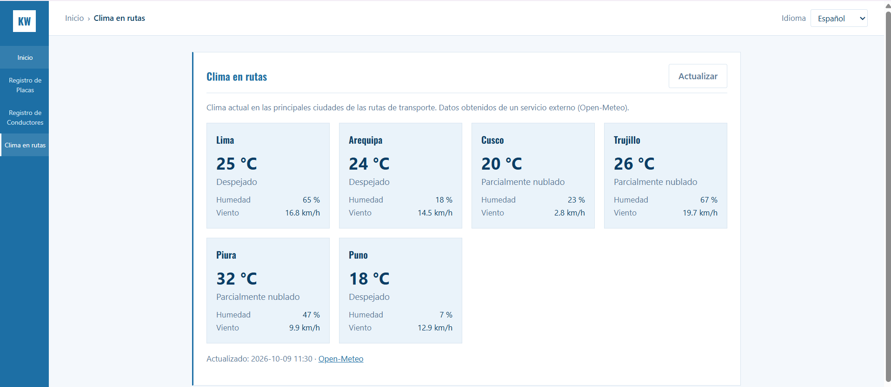
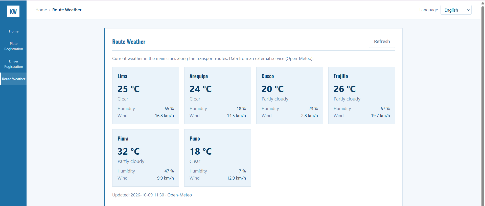

# Tarea 05 — Aplicación basada en componentes distribuidos

Esta práctica continúa el proyecto de **Registro de Placas y Conductores** de la tarea04.
Se hicieron dos cosas:

1. Un **diagrama de componentes** de la aplicación.
2. El **consumo de un servicio externo desde el frontend**: el clima actual en las ciudades de las rutas de transporte, usando la API pública **Open-Meteo**.

---

## Tecnologías usadas

| Parte | Herramientas |
|-------|--------------|
| Frontend | Vue 3, Vite, vue-router, vue-i18n, axios |
| Backend | Node.js, Express, Sequelize |
| Base de datos | PostgreSQL |
| Servicio externo | [Open-Meteo](https://open-meteo.com) (API REST pública de clima) |

---

## 1. Diagrama de componentes

La aplicación está formada por **componentes distribuidos**. Cada uno se ejecuta en un lugar distinto y se comunica con los demás por la red:



> El diagrama está escrito en **Mermaid** , https://mermaid.live

### Descripción de los componentes

| Componente | Dónde se ejecuta | Responsabilidad |
|------------|------------------|-----------------|
| **Frontend (Vue)** | Navegador del usuario | Interfaz, idiomas (i18n) y validación de formularios con regex |
| `api.js` | Navegador | Cliente HTTP hacia **nuestro** backend |
| `climaService.js` | Navegador | Cliente HTTP hacia el **servicio externo** Open-Meteo |
| **Backend (Express)** | Servidor Node, puerto 3000 | API REST de placas y conductores, con capas routes → controllers → services → repositories → models |
| **PostgreSQL** | Servidor de base de datos, puerto 5432 | Guarda las placas y los conductores |
| **Open-Meteo** | Internet (servidor de terceros) | Da el clima actual de cualquier coordenada |

### Interfaces (cómo se comunican)

| Desde | Hacia | Protocolo | Ejemplo |
|-------|-------|-----------|---------|
| Frontend | Backend | HTTP REST + JSON | `GET http://localhost:3000/api/placas` |
| Backend | PostgreSQL | SQL (Sequelize) | `SELECT * FROM placas` |
| Frontend | Open-Meteo | HTTPS REST + JSON | `GET https://api.open-meteo.com/v1/forecast?latitude=-12.04&longitude=-77.04&current=temperature_2m` |

---

## 2. Consumo de un servicio externo desde el frontend

### Paso 1 — Elegir el servicio
Se eligió **Open-Meteo** porque:
- Es **gratuito** y **no necesita API key** .
- El navegador puede llamarlo directamente sin pasar por nuestro backend.
- Tiene relación con el negocio: el clima afecta a los camiones en ruta.

### Paso 2 — Crear el cliente del servicio externo
Archivo: `frontend/src/services/climaService.js`

climaService.js sirve solo para conectar la aplicación (el frontend) con Open-Meteo. :

```js
const openMeteo = axios.create({ baseURL: 'https://api.open-meteo.com/v1' });

export async function obtenerClimaActual(ciudades = CIUDADES) {
  const { data } = await openMeteo.get('/forecast', {
    params: {
      latitude: ciudades.map((c) => c.lat).join(','),
      longitude: ciudades.map((c) => c.lon).join(','),
      current: 'temperature_2m,relative_humidity_2m,wind_speed_10m,weather_code',
      timezone: 'America/Lima',
    },
  });
  // ...convierte la respuesta a { ciudad, temperatura, humedad, viento, codigo }
}
```

- Una sola petición trae el clima de las 6 ciudades: Lima, Arequipa, Cusco, Trujillo, Piura y Puno.

### Paso 3 — Crear la vista "Clima en rutas"
Archivo: `frontend/src/views/ClimaView.vue`

- Al abrir la vista se llama al servicio y se muestra una tarjeta por ciudad con temperatura, estado, humedad y viento.
- El botón **↻ Actualizar** vuelve a consultar el servicio.
- Si no hay internet o el servicio falla, se muestra un mensaje de error en lugar de romper la página.
- Todos los textos están traducidos (es / en / pt), igual que en la tarea04.

### Paso 4 — Agregarla al menú
- `router.js` → nueva ruta `/clima`.
- `Sidebar.vue` → nuevo ítem en el menú lateral.
- `InicioView.vue` → nuevo acceso directo en la pantalla de inicio.


---

## Cómo ejecutarlo

1. Backend:
   ```
   cd backend
   cp .env.example .env    
   npm install
   npm run dev
   ```
2. Frontend (en otra terminal):
   ```
   cd frontend
   npm install
   npm run dev
   ```
3. Abrir http://localhost:5173 y entrar a ** Clima en rutas**.

---

## Capturas de pantalla

### 1. Diagrama de componentes (exportado como imagen)


### 3. Vista de clima con datos del servicio externo


### 4. Vista de clima en otro idioma


