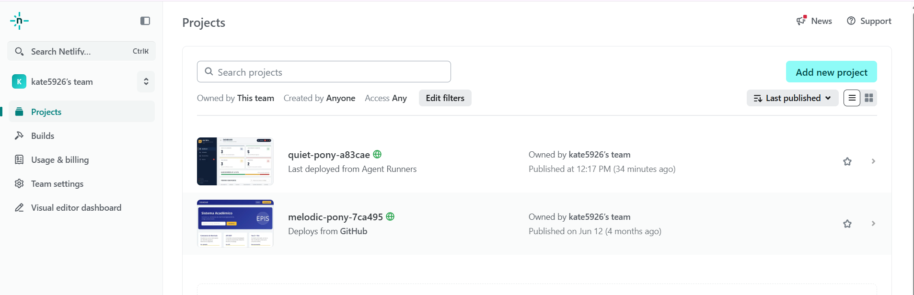
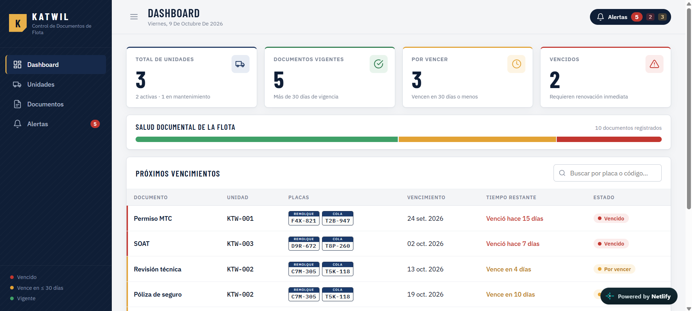
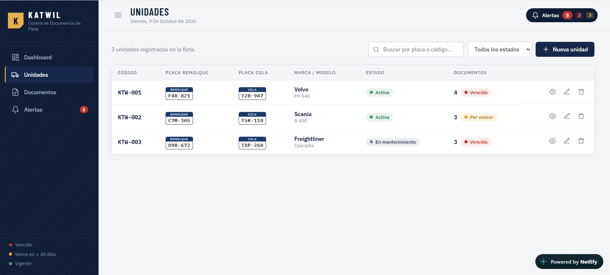
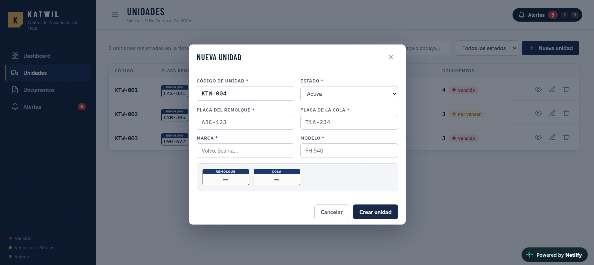
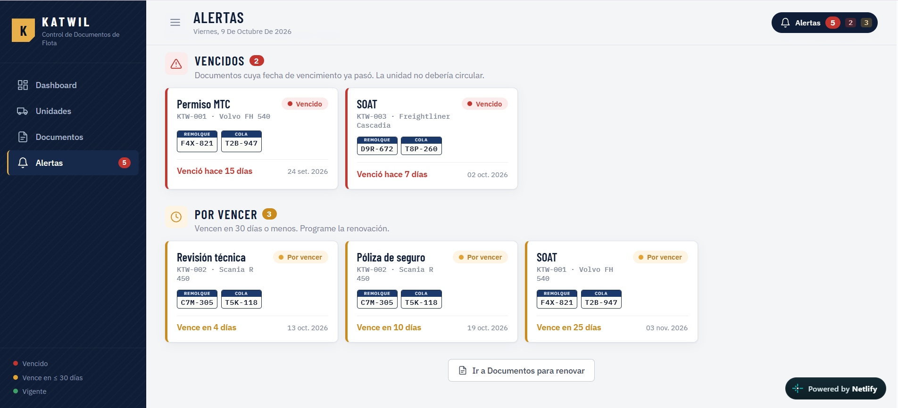

# Tarea 06 — Aplicación web publicada en Netlify

En esta práctica se creó una cuenta en **Netlify** y, desde su panel, se generó y publicó una aplicación web parecida al proyecto del curso: **Registro de Placas y Conductores**.

- **Aplicación publicada:** `https://quiet-pony-a83cae.netlify.app` 

---

## 1. Creación de la cuenta en Netlify

1. Se entró a https://www.netlify.com y se hizo clic en **Sign up**.
2. Se registró la cuenta con **GitHub**.
3. Al terminar, se ingresó al panel principal de Netlify.

---

## 2. Creación de la aplicación

 Netlify generó el código de la aplicación y la publicó automáticamente.

## Capturas de pantalla

### 1. Cuenta creada en Netlify

### Aplicación - Inicio

### 5. Registro de Placas

### 6. Registro de Conductores con validación

### 7. Alertas

